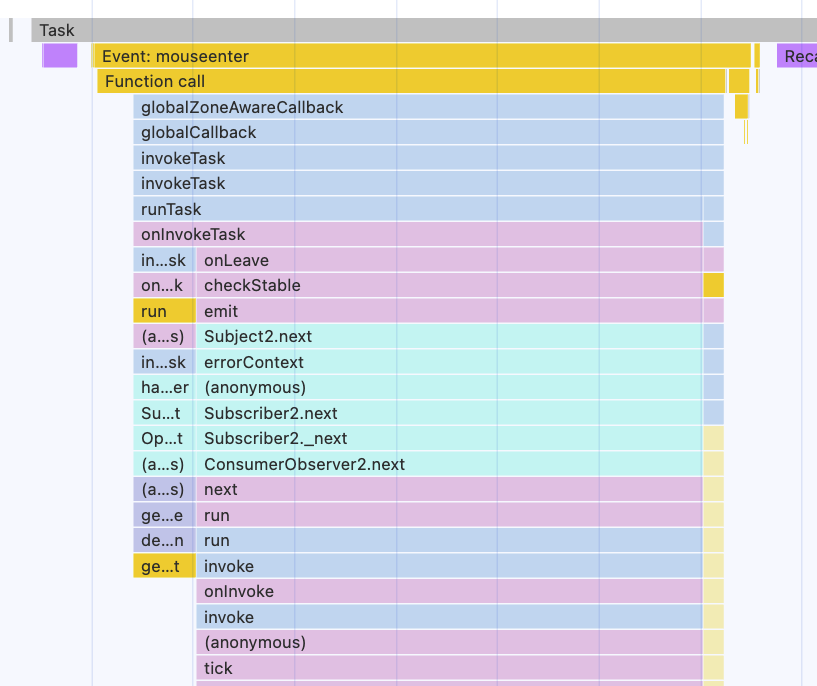

# ChangeDetection - Going zoneless Exercise

In this exercise you'll get to know how to finally be able to officially remove zone.js from your application.

## Provide no-op zone & ChangeDetection

As a first step, let's use the ready2use defaults, by adding `provideExperimentalZonelessChangeDetection` to the providers
array in your `appConfig`.

For this, open the `app.config.ts` file located in the apps root folder.

```ts
// app.config.ts
import { ApplicationConfig, provideExperimentalZonelessChangeDetection /* 👈️ add this */ } from '@angular/core';


export const appConfig: ApplicationConfig = {
  providers: [
    provideHttpClient(
      withInterceptors([readAccessInterceptor])
    ),
    provideRouter(routes),
    provideFastSVG({
      url: (name: string) => `assets/svg-icons/${name}.svg`,
      defaultSize: '12',
    }),
    provideExperimentalZonelessChangeDetection() // 👈️ add this
  ]
};
```

As a next step we need to remove the `zone.js` polyfills, otherwise all browser APIs are still being 
monkeypatched.

Remove the polyfills section in the angular.json file:

```diff
// angular.json

-"polyfills": [
-  "zone.js"
-],
```

[OPTIONAL] Delete the dependency to zone.js from package.json

```bash
npm uninstall zone.js
```

GREAT!!! Enjoy your application without zone.js. Make sure everything is still running as it should.


<details>
  <summary>Flamecharts before and after zoneless</summary>

### Before zoneless

zone.js will have all those: 

globalZoneAwareCallback, onInvokeTask, onHasTask, runTask, scheduleTask,
run, invoke, onInvoke, invoke and then `tick` method.



### After zoneless

Without zone.js, Angular will schedule change detection using either `setTimeout` or `requestAnimationFrame`.

This makes it easier to test and debug your application using flamecharts.


</details>
