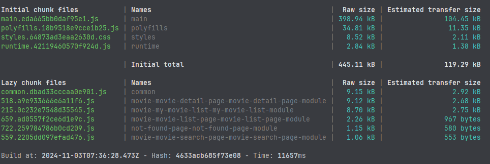
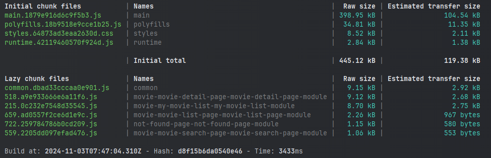
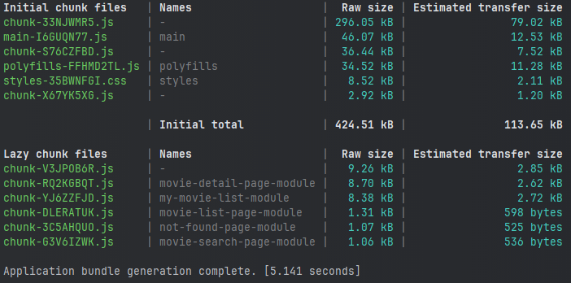

# New Build System Migration

In this exercise we will get to know our build tools and how the new build system can help,
optimize our development process and the bundle size of your application.

## 1. Webpack - Build performance & bundle size

### Build performance and bundle size

Let start by measuring the baseline of build performance with webpack, start by deleting the `.angular/` directory
at the root of the project and then run the build command:

```bash
ng build
```

After this build is complete inspect the console output and identify how long it took to build and the size of the initial bundles:

<details>
    <summary>Webpack results</summary>



</details>

<details>
    <summary>Bonus</summary>

Angular optimizes the build process by caching parts of the build process, try running the build command again and see how long it takes:


```bash
ng build
```

You will notice it take significantly less time as its reusing the cache from the previous build:



</details>

## 2. Migrate to new build system

Make sure that you currently have no changes in the repo and run the migration command:

```bash
npx ng update @angular/cli --name use-application-builder
```

<details>
    <summary>Migration changes</summary>

After this process is complete inspect the changes in your `angular.json`, and note what changes were made:


```diff
// angular.json

"build": {

-    "builder": "@angular-devkit/build-angular:browser",
+    "builder": "@angular/build:application",

     "options": {
-        "main": "src/main.ts",
+        "browser": "src/main.ts"

-        "outputPath": "dist/ws-ng-poland-2024-signal-arch",
+        "outputPath": {
+            "base": "dist/ws-ng-poland-2024-signal-arch"
+         },
     }
}

"serve": {

-    "builder": "@angular-devkit/build-angular:dev-server",
+    "builder": "@angular/build:dev-server",

}
```

</details>

## 3. Esbuild - Build performance & bundle size

Let's measure and compare the improvements in bundle size, build and rebuild performance and after this migration.

### Build performance and bundle size

To compare the build performance and bundle size of out application lets run the same steps as we did before, delete the `.angular` directory and run the build command: 

```bash
ng build
```
<details>
    <summary>Esbuild results</summary>

After the build completes inspect the console output and compare the performance of the build process and the size of the output bundles.



</details>
