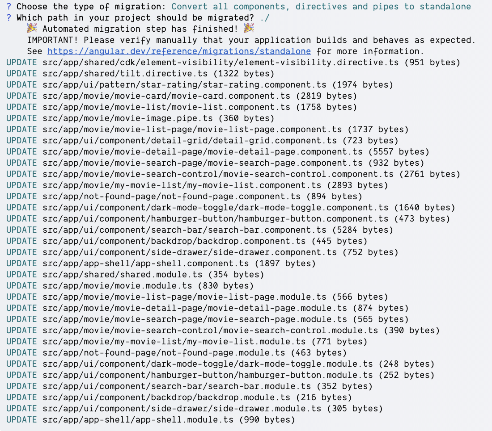
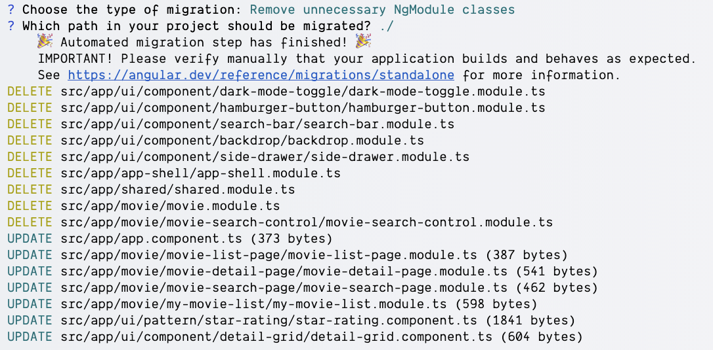
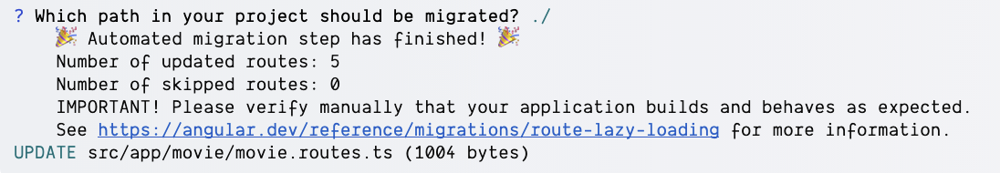

# Modern Angular - Standalone Components Automatic Migration

In this exercise, we will migrate what's left of our application to the new `standalone` components API.
And for that we will use the migration schematics provided by the Angular team.

## Migrate to standalone 
In order to migrate to the new `standalone` components API, we need to use the `ng generate` command.

```bash
npx ng g @angular/core:standalone 
```

You should see the following output:

```
? Choose the type of migration: (Use arrow keys)
❯ Convert all components, directives and pipes to standalone
  Remove unnecessary NgModule classes
  Bootstrap the application using standalone APIs
```

As a first step, let's convert all components, directives and pipes to standalone. Choose the first option.

<details>
    <summary>Standalone Migration output</summary>



</details>


After the migration is complete, inspect the changes in your git diff.


## Remove unnecessary NgModule classes
As a next step, we need to remove the unnecessary `NgModule` classes from our application.
Run the same command again and choose the second option.

```bash
npx ng g @angular/core:standalone 
```

```
? Choose the type of migration: (Use arrow keys)
  Convert all components, directives and pipes to standalone
❯ Remove unnecessary NgModule classes
  Bootstrap the application using standalone APIs
```

<details>
    <summary>Remove unnecessary NgModule classes output</summary>



</details>

After the migration is complete, inspect the changes in your git diff.

## Remove leftover NgModule based routing with standalone components 
As a last step, we need to remove the leftover `NgModule` based routing with standalone components.

Most of the leftover `NgModule`s are just doing one thing, routing and lazy loading. Let's do two things.

1. Use components directly instead of `NgModule`s in the routing configuration
2. Run automated migration to convert `component` to `loadComonent` in the routing configuration

### 1. Use components directly instead of `NgModule`s in the routing configuration
Remove all `loadChildren` and `NgModule` based routing configurations.

<details>
    <summary>Use standalone components in routing configuration</summary>

```ts
import { Routes } from '@angular/router';

import { AuthGuard } from '../core/auth.guard';
import { MovieDetailPageComponent } from './movie-detail-page/movie-detail-page.component';
import { MovieListPageComponent } from './movie-list-page/movie-list-page.component';
import { MovieSearchPageComponent } from './movie-search-page/movie-search-page.component';
import { MyMovieListComponent } from './my-movie-list/my-movie-list.component';

export const movieRoutes: Routes = [
  {
    path: 'list/:category',
    component: MovieListPageComponent,
  },
  {
    path: 'list/genre/:id',
    component: MovieListPageComponent,
  },
  {
    path: 'movie/:id',
    component: MovieDetailPageComponent,
  },
  {
    path: 'search/:query',
    component: MovieSearchPageComponent,
  },
  {
    path: 'my-movies',
    component: MyMovieListComponent,
    canActivate: [AuthGuard],
  },
  {
    path: '',
    redirectTo: 'list/popular',
    pathMatch: 'full',
  },
];
```

</details>

### 2. Run automated migration to convert `component` to `loadComonent` in the routing configuration

Run the following command to convert the `component` to `loadComponent` in the routing configuration.

```bash
npx ng g @angular/core:route-lazy-loading
```

<details>
    <summary>Routes Lazy Loading output</summary>



and your `movie.routes.ts` should look like this:

```ts
import { Routes } from '@angular/router';

import { AuthGuard } from '../core/auth.guard';

export const movieRoutes: Routes = [
  {
    path: 'list/:category',
    loadComponent: () =>
      import('./movie-list-page/movie-list-page.component').then(
        (m) => m.MovieListPageComponent,
      ),
  },
  {
    path: 'list/genre/:id',
    loadComponent: () =>
      import('./movie-list-page/movie-list-page.component').then(
        (m) => m.MovieListPageComponent,
      ),
  },
  {
    path: 'movie/:id',
    loadComponent: () =>
      import('./movie-detail-page/movie-detail-page.component').then(
        (m) => m.MovieDetailPageComponent,
      ),
  },
  {
    path: 'search/:query',
    loadComponent: () =>
      import('./movie-search-page/movie-search-page.component').then(
        (m) => m.MovieSearchPageComponent,
      ),
  },
  {
    path: 'my-movies',
    loadComponent: () =>
      import('./my-movie-list/my-movie-list.component').then(
        (m) => m.MyMovieListComponent,
      ),
    canActivate: [AuthGuard],
  },
  {
    path: '',
    redirectTo: 'list/popular',
    pathMatch: 'full',
  },
];
```

</details>

###  3. [OPTIONAL] Remove the leftover `NgModule`s 
Because they are no longer used and needed, we can remove them manually.

## Congrats!
You have successfully migrated your application to the new `standalone` components API and benefited from the provided Angular schematics to skip doing manual work.
